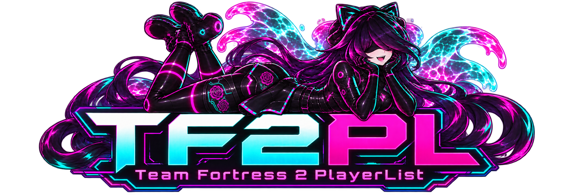
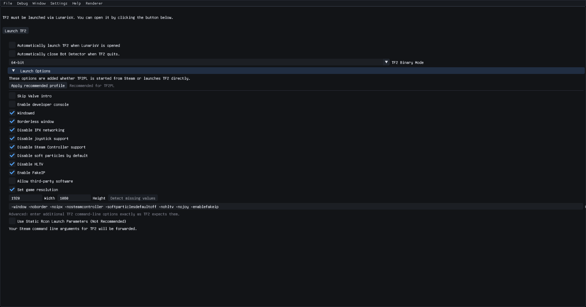
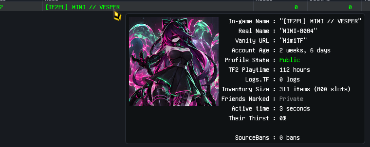
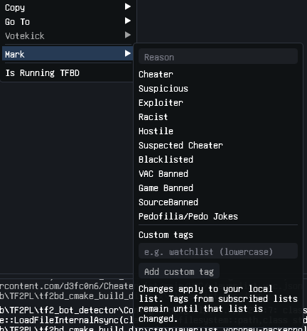

  

  <strong>A player intelligence, marking, and launch companion for Team Fortress 2.</strong> 
  TF2PL is developed by LunarisV and built on the open-source TF2 Bot Detector foundation.

  <a href="https://github.com/Lunaris-Surf/TF2PL/releases">Releases</a> ·
  <a href="https://github.com/Lunaris-Surf/TF2PL/issues">Issues</a> ·
  <a href="LUNARISV.md">Configuration guide</a> ·
  <a href="LICENSE">MIT License</a>

## What is TF2PL?

TF2PL — **Team Fortress 2 PlayerList** — keeps useful player context close while you play. It reads TF2's console output, enriches player records with supported public data, displays an at-a-glance dossier, and lets you maintain local or subscribed player lists with clear, color-coded marks.

Version 2.0 expands the project into a single place to launch TF2, inspect a server, mark players, manage lists, and export data for compatible tools.

> [!IMPORTANT]
> TF2PL assists human moderation. A mark is context, not proof by itself. Review evidence and follow the rules of the server or community you are playing on.

## Highlights

- **TF2 launcher:** start the game through TF2PL with readable controls for common launch options. The recommended profile includes borderless windowed mode, disabled legacy input features, FakeIP, and display-resolution detection. Explicit width and height values are never overwritten.
- **Live player dossiers:** hover a player to see identity, account age, TF2 playtime, inventory information, activity, and available ban data.
- **Flexible player marking:** use built-in marks such as Cheater, Suspicious, Exploiter, Racist, Hostile, VAC Banned, Game Banned, Source Banned, and more, plus your own custom tags.
- **Custom tag colors:** every built-in and custom tag can have its own scoreboard color.
- **Complete Steam identity sets:** records retain SteamID, SteamID3/SteamID32, and SteamID64, with SteamID64 as the primary identity.
- **Two-format total export:** export a full TF2PL list and a TF2BD-compatible list. Marks unsupported by TF2BD are preserved in the proof field.
- **Local-first lists:** your local data remains under your control, while optional subscribed lists can add shared context.

## Launcher

The launcher can manage TF2 directly or apply the same selected launch options when TF2PL is started through Steam. Recommended settings are available in one click and remain individually editable.

  

## Player dossier

Hover a player in the live scoreboard to open a compact dossier. Data appears as it becomes available, so TF2PL stays useful even when an external service is unavailable or a Steam profile is private.

  

## Marks and custom tags

Right-click a player to copy identifiers, visit supported profile services, initiate an eligible votekick, or update your local player list. Built-in marks cover common cases; custom lowercase tags let you build a system that fits your own community.

  

`Racist` is reserved for racial hatred. `Hostile` covers hateful behavior directed at other protected groups, including anti-LGBT harassment. This separation keeps rules and exports explicit.

## Installation

1. Download the appropriate package from [GitHub Releases](https://github.com/Lunaris-Surf/TF2PL/releases).
2. Extract the complete package to a writable folder. Do not run the executable from inside the archive.
3. Open TF2PL and complete the first-run setup.
4. Allow Steam integration and internet features only if you want to use them.
5. Launch TF2 from TF2PL when prompted.

Keep the packaged `cfg`, `fonts`, `images`, `licenses`, and `schemas` folders beside the executable. Missing packaged resources can prevent parts of the interface from loading correctly.

## Player-list compatibility

TF2PL continues to read TF2BD schema-v3 player lists and rules. Its extended format adds custom tags and complete Steam identity sets while keeping the familiar `players`, `steamid`, `attributes`, and `proof` structure.

Total Export writes:

- `cfg/playerlist.export.tf2pl.json` — the complete TF2PL representation.
- `cfg/playerlist.export.tf2bd.json` — limited to Cheater, Racist, Exploiter, and Suspicious attributes, with the complete TF2PL mark set recorded in `proof`.

See [LUNARISV.md](LUNARISV.md) for schema details, tag IDs, rule examples, and validation notes.

## Versioning and releases

The repository root [`VERSION`](VERSION) file is the single source of truth for the public release version. It contains a three-part semantic version such as `2.0.0`.

- Change `VERSION` when preparing a release.
- CMake reads its major, minor, and patch values automatically.
- GitHub Actions appends its run number as the fourth build component.
- Release tags should use the matching `vMAJOR.MINOR.PATCH` form, such as `v2.0.0`.
- The in-app updater checks releases from this repository.

This keeps local builds, Windows resources, CI artifacts, and the updater aligned without copying a version number through several files.

## Building from source

TF2PL uses CMake, C++20, and the dependencies pinned in this repository's submodules and vcpkg manifest. Clone recursively, configure with your supported toolchain, then build the `tf2_bot_detector` target. The GitHub Actions workflows contain the maintained Windows and Linux CI configurations.

Local development builds identify themselves as custom builds. CI builds receive the workflow run number so packaged versions remain ordered for update comparisons.

## Privacy and network access

TF2PL can operate with network features disabled. When enabled, it may contact Steam services, configured player-list sources, SteamHistory-supported services, and GitHub Releases for updates. API keys are stored in the local configuration and should never be committed or shared in logs.

## Credits

TF2PL is maintained by **LunarisV**. It is derived from [TF2 Bot Detector](https://github.com/PazerOP/tf2_bot_detector), originally created by Matt “pazer” Haynie, and retains contributions and third-party attributions from that project. Full dependency license texts are shipped in the `staging/licenses` directory.

The TF2PL masthead features Mimi Vesper and was created for this repository from the maintainer-provided character design.

TF2PL is an independent community project and is not affiliated with or endorsed by Valve Corporation.

## License

TF2PL is distributed under the [MIT License](LICENSE).
